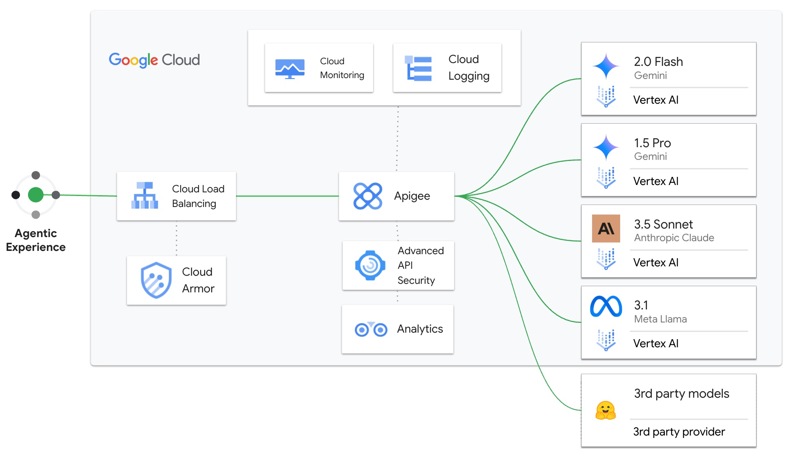

# llm-routing

---

- This is a sample Apigee proxy to demonstrate the routing capabilities of Apigee across different LLM providers. In this sample we will use Google VertexAI and Hugging Face as the LLM providers
- The framework will easily help onboarding other providers using configurations



## Pre-Requisites

1. [Provision Apigee X](https://cloud.google.com/apigee/docs/api-platform/get-started/provisioning-intro)
2. Configure [external access](https://cloud.google.com/apigee/docs/api-platform/get-started/configure-routing#external-access) for API traffic to your Apigee X instance
3. Enable Vertex AI in your project
4. Create a Hugging Face Account and generate a token
5. Make sure the following tools are available in your terminal's $PATH (Cloud Shell has these preconfigured)
    - [gcloud SDK](https://cloud.google.com/sdk/docs/install)
    - [apigeecli](https://github.com/apigee/apigeecli)
    - unzip
    - curl
    - jq

Let's get started!

---

## Payloads

The payload consists of `promptRequest` and `logPayload` fields. See below for example

```json
{
   "promptRequest":{},
   "logPayload":true
}
```

Every provider has its own payload. You just need to pass the entire payload required for the provider within the `promptRequest` field. If there are any fields missing within that, the provider will return an error.

`logPayload` is a flag you can use for Apigee to log the payloads to Cloud Logging.

Similarly, the response sent from the provider is returned in the `promptResponse` field of the payload. Along with that, you will also get `usageMetadata` that includes the number of tokens used. See below for example

```json
{
   "promptResponse": ".....", 
   "usageMetadata":{
      "promptTokenCount": 10,
      "generatedTokenCount": 150,
      "totalTokenCount": 160
   }
}
```

## Routing Logic

The sample uses the [Key Value Map](https://cloud.google.com/apigee/docs/api-platform/cache/key-value-maps) to store the different LLM provider configurations. In this sample, we will create a KVM called `llm-routing-config` which will contain the following configurations for each provider. Each entry (for each provider) will contain the following attributes:

| Attribute | Description |
|---|---|
| target_url | The URL of the actual API (for ex: <https://us-east1-aiplatform.googleapis.com/v1/projects/apigee-ai/locations/us-east1/publishers/google/models/{model}:generateContent>) |
| auth_type | Authentication type. Valid values are  `oauth` or `service_account`. `service_account` is used for Google based services which can use the in-built Google Auth within Apigee |
| auth_token_type | Authentication Token type. Valid values are `Bearer` or `Basic` |
| auth_token | The token to be used for authentication. For ex Hugging Face token. If you are using  `service_account` auth_type, then you can pass `null` for this field |
| request_jsonpath | Provide the JSON path within the request payload that contains the actual prompt. Every LLM provider has its own structure for the request payload. For Apigee to extract that, this needs to be passed. For example, the path for Hugging Face is `$.promptRequest.inputs` and for Google VertexAI is `$.promptRequest.contents.parts[*].text` |
| response_jsonpath | Provide the JSON path within the response payload that contains the actual prompt. Similar to the request above, each LLM provider sends different payloads as part of text generation. To extract that, this field is required. For example, the path for Hugging Face is `$.[0].generated_text` and for Google VertexAI is `$.candidates[0].content.parts[*].text` |

A sample KVM entry for Google Vertex AI is as follows:

```json
{
   "target_url":"https:/$REGION-aiplatform.googleapis.com/v1/projects/$PROJECT_ID/locations/$REGION/publishers/google/models/$MODEL_NAME:generateContent",
   "auth_type":"service_account",
   "auth_token_type":"Bearer",
   "auth_token":null,
   "request_jsonpath":"$.promptRequest.contents.parts[*].text",
   "response_jsonpath":"$.candidates[0].content.parts[*].text"
}
```
  
You can refer to this sample <walkthrough-editor-open-file filePath="llm-routing/config/env__envname__llm-routing-config__kvmfile__0.json">keyvalue map file</walkthrough-editor-open-file> that contains the configurations for each provider.

---

## Setup environment

Ensure you have an active GCP account selected in the Cloud shell

```sh
gcloud auth login
```

Navigate to the 'llm-routing' directory in the Cloud shell.

```sh
cd llm-routing
```

Edit the provided sample `env.sh` file, and set the environment variables there.

Click <walkthrough-editor-open-file filePath="llm-routing/env.sh">here</walkthrough-editor-open-file> to open the file in the editor

Then, source the `env.sh` file in the Cloud shell.

```sh
source ./env.sh
```

---

## Deploy Apigee configurations

Next, let's deploy the sample to Apigee. Just run

```bash
./deploy-llm-routing.sh
```

Export the `APP_CLIENT_ID` variable as mentioned in the command output

---

### Verification

You can test the sample with the following curl commands:

To Gemini

```sh
curl --location "https://$APIGEE_HOST/v1/samples/llm-routing/providers/google/models/gemini-1.5-flash-001:generateText" \
--header "Content-Type: application/json" \
--header "x-apikey: $APP_CLIENT_ID" \
--data '{
   "promptRequest":{
      "contents":{
         "role":"user",
         "parts":[
            {
               "text":"Suggest name for a flower shop"
            }
         ]
      }
   },
   "logPayload":true
}'
```

```sh
curl --location "https://$APIGEE_HOST/v1/samples/llm-routing/providers/google/models/gemini-1.5-flash-001:generateText" \
--header "Content-Type: application/json" \
--header "x-apikey: $APP_CLIENT_ID" \
--data '{
   "promptRequest":{
      "contents":{
         "role":"user",
         "parts":[
            {
               "fileData":{
                  "mimeType":"image/jpeg",
                  "fileUri":"gs://generativeai-downloads/images/scones.jpg"
               }
            },
            {
               "text":"Describe this picture."
            }
         ]
      }
   },
   "logPayload":true
}'
```

To Hugging Face

```sh
curl --location "https://$APIGEE_HOST/v1/samples/llm-routing/providers/hugging_face/models/gpt2:generateText" \
--header "Content-Type: application/json" \
--header "x-apikey: $APP_CLIENT_ID" \
--data '{
    "promptRequest": {
        "inputs": "Suggest name for a flower shop"
    },
    "logPayload": true
}'
```

```sh
curl --location "https://$APIGEE_HOST/v1/samples/llm-routing/providers/hugging_face/models/distilbert/distilgpt2:generateText" \
--header "Content-Type: application/json" \
--header "x-apikey: $APP_CLIENT_ID" \
--data '{
    "promptRequest": {
        "inputs": "Suggest name for a flower shop"
    },
    "logPayload": true
}'
```

---

## Conclusion

<walkthrough-conclusion-trophy></walkthrough-conclusion-trophy>

Congratulations! You've successfully deployed Apigee proxy to route calls to different LLM providers

<walkthrough-inline-feedback></walkthrough-inline-feedback>

## Cleanup

If you want to clean up the artifacts from this example in your Apigee Organization, first source your `env.sh` script, and then run

```bash
./clean-up-llm-routing.sh
```
